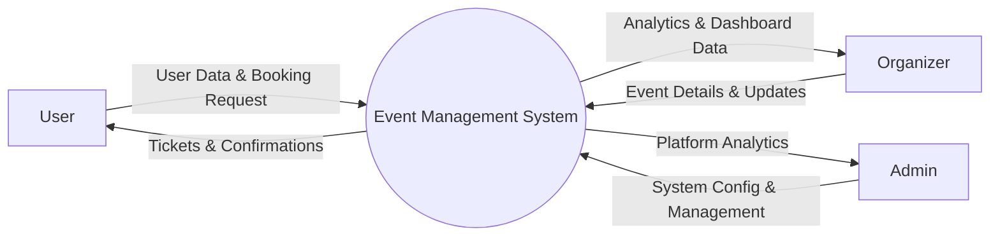
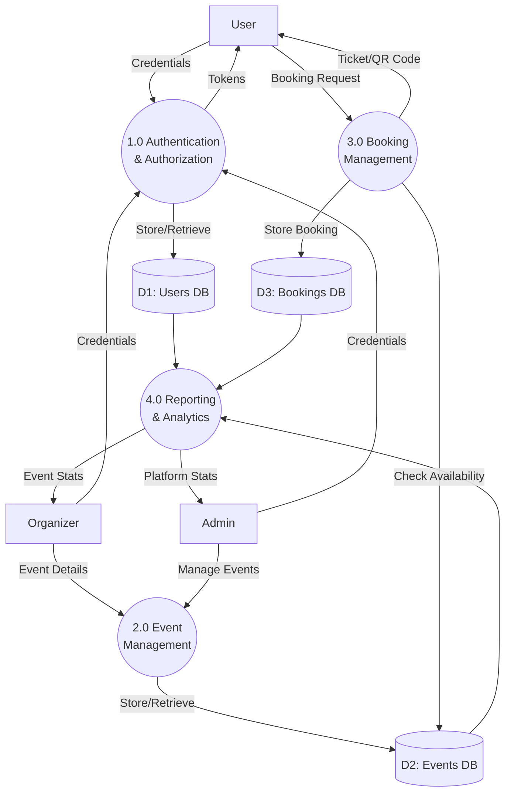

# Data Flow Diagrams (DFD)
## Event Management System (EMS)

### Level 0 DFD (Context Diagram)

The Context Diagram shows the EMS as a single process interacting with external entities (User, Organizer, Admin, Payment Gateway).



### Level 1 DFD (Main Modules)

This level breaks down the main system into major processes: Authentication, Event Management, Booking Management, and Reporting.



### Level 2 DFD (Booking Process Detail - Process 3.0)

This level provides a detailed view of the Booking Management process.

```mermaid
flowchart TD
    %% Entities & Stores
    User[User]
    D2[(D2: Events DB)]
    D3[(D3: Bookings DB)]
    
    %% Processes
    P3_1((3.1 Validate \nEvent Availability))
    P3_2((3.2 Process \nPayment Simulation))
    P3_3((3.3 Generate \nBooking Record))
    P3_4((3.4 Generate \nQR Ticket))
    
    %% Flows
    User -->|Select Event| P3_1
    P3_1 -->|Fetch Event Capacity| D2
    P3_1 -->|Availability Status| P3_2
    
    P3_2 -->|Payment Success| P3_3
    P3_3 -->|Save Booking| D3
    P3_3 -->|Booking ID| P3_4
    
    P3_4 -->|Digital Ticket (QR)| User
```
