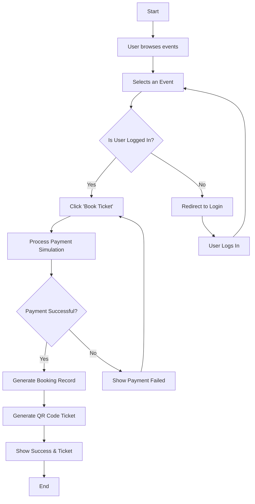
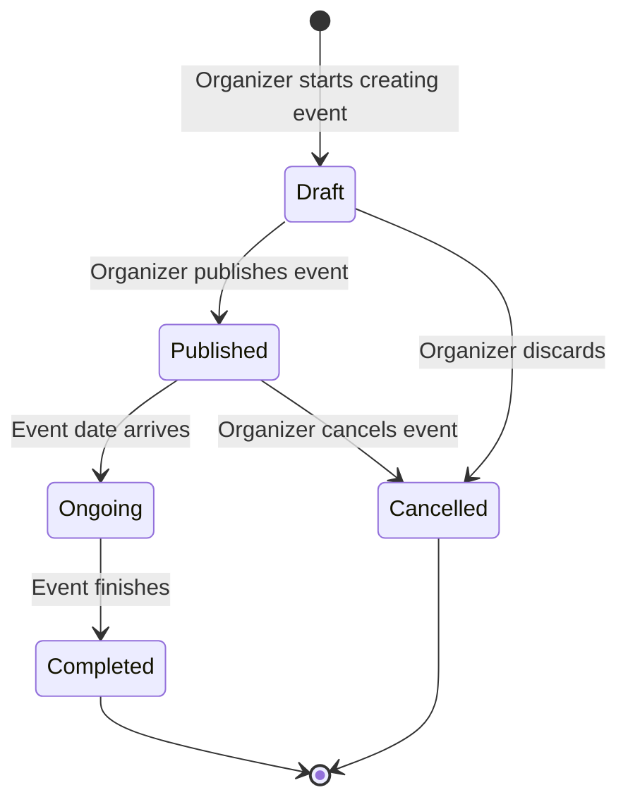
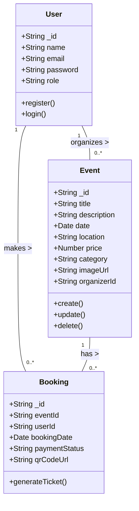
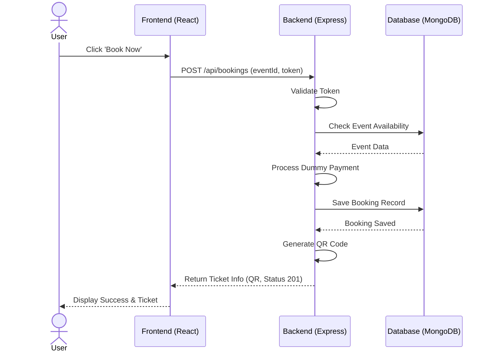

# UML Diagrams
## Event Management System (EMS)

### 1. Use Case Diagram

```mermaid
usecaseDiagram
    actor User as Customer
    actor Organizer
    actor Admin

    package "Event Management System" {
        usecase "Register/Login" as UC1
        usecase "Browse Events" as UC2
        usecase "Search & Filter" as UC3
        usecase "Book Event" as UC4
        usecase "View Tickets" as UC5
        
        usecase "Create Event" as UC6
        usecase "Manage Own Events" as UC7
        usecase "View Event Analytics" as UC8
        
        usecase "Manage All Users" as UC9
        usecase "Manage All Events" as UC10
        usecase "View Platform Analytics" as UC11
    }

    User --> UC1
    User --> UC2
    User --> UC3
    User --> UC4
    User --> UC5

    Organizer --> UC1
    Organizer --> UC6
    Organizer --> UC7
    Organizer --> UC8

    Admin --> UC1
    Admin --> UC9
    Admin --> UC10
    Admin --> UC11
```

### 2. Activity Diagram (Booking Flow)

```mermaid
activityDiagram
    start
    :User browses events;
    :Selects an Event;
    if (Is User Logged In?) then (yes)
        :Click "Book Ticket";
        :Redirect to Payment;
        if (Payment Successful?) then (yes)
            :Generate Booking Record;
            :Generate QR Code Ticket;
            :Show Success Page & Ticket;
        else (no)
            :Show Payment Failed Error;
        endif
    else (no)
        :Redirect to Login Page;
        :User Logs In;
        :Return to Event Page;
    endif
    stop
```

*(Note: In Mermaid, activity diagrams are often rendered via stateDiagram or flowchart. Below is the Flowchart equivalent for standard rendering)*



### 3. State Diagram (Event Lifecycle)



### 4. Class Diagram



### 5. Sequence Diagram (Booking Process)


